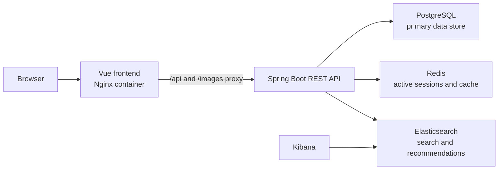

# Recipe Sharing and Recommendation Platform

A full-stack recipe platform for creating, discovering, saving, rating, and recommending recipes. The project combines a Vue frontend with a Spring Boot backend and uses Docker Compose to run the application together with PostgreSQL, Redis, and Elasticsearch.

## Features

- User registration, login, logout, and profile management
- JWT authentication with Redis-backed active session validation
- Recipe creation, editing, detail pages, and image uploads
- Recipe search and filtering with Elasticsearch
- Recommendation views for trending, contextual, and preference-based recipes
- Saved recipes, recipe ratings, and user preference management
- Cuisine and flavour taxonomy support with Redis caching
- Containerized local and production-like deployment workflows

## Tech Stack

### Backend

- Java 21
- Spring Boot
- Spring Security
- Spring Data JPA
- Spring Data Redis
- Spring Data Elasticsearch
- PostgreSQL
- MapStruct
- Maven Wrapper

### Frontend

- Vue 3
- Vue Router
- Pinia
- Element Plus
- Axios
- Vite
- Nginx for containerized frontend serving and API proxying

### Infrastructure

- Docker
- Docker Compose
- PostgreSQL
- Redis
- Elasticsearch
- Kibana

### Delivery

- GitHub Actions CI and CD workflows
- Docker Hub images for backend and frontend
- Azure Virtual Machine deployment over SSH

## Architecture



The frontend container serves the Vue application and proxies `/api/` and `/images/` requests to the backend container. PostgreSQL is the primary data store, Redis supports active authentication sessions and selected caching use cases, and Elasticsearch powers recipe search and recommendation-oriented retrieval.

## Docker and Deployment

The repository contains two Compose configurations:

| File | Purpose |
| --- | --- |
| `docker-compose.yml` | Local source-based environment that builds the backend and frontend images from this repository |
| `docker-compose.prod.yml` | Production-like environment that pulls published backend and frontend images from Docker Hub |

The production-like stack is currently deployed on an Azure Virtual Machine. The VM runs Docker Compose and stores environment-specific runtime secrets in a server-side `.env` file.

## CI/CD Pipeline

The project uses separate GitHub Actions workflows for integration and delivery.

### Continuous Integration

`Docker CI` runs on pull requests and pushes to `master` or `main`:

1. Starts PostgreSQL, Redis, and Elasticsearch test dependencies
2. Runs backend Maven tests
3. Builds the full Docker Compose stack from source
4. Starts the stack and smoke-checks the frontend, backend health endpoint, and Elasticsearch

### Continuous Delivery

`Docker CD` runs after a successful `Docker CI` workflow on `master`:

1. Builds and publishes backend and frontend Docker images to Docker Hub
2. Tags images with both `latest` and the verified commit SHA
3. Connects to the Azure VM over SSH
4. Uploads `docker-compose.prod.yml`
5. Pulls the published images and recreates the production stack
6. Verifies the deployed frontend and backend health endpoints

## Quick Start

### Prerequisites

- Docker Desktop or Docker Engine with Docker Compose
- A local `.env` file based on `.env.example`

### Run the local stack

```bash
cp .env.example .env
docker compose up -d --build
```

After startup:

- Frontend: `http://localhost`
- Backend health: `http://localhost:8080/actuator/health`
- Elasticsearch: `http://localhost:9200`
- Kibana: `http://localhost:5601`

To stop the stack and remove its containers:

```bash
docker compose down
```

## Configuration

The Compose environments use the following local or server-side environment variables:

| Variable | Purpose |
| --- | --- |
| `FRONTEND_PORT` | Host port exposed for the frontend container |
| `BACKEND_PORT` | Host port exposed for the backend container |
| `POSTGRES_PASSWORD` | PostgreSQL password used by the database and backend |
| `JWT_SECRET` | Secret used to sign backend JWTs |

Real `.env` files are intentionally ignored by Git. Use `.env.example` as a template and keep deployment secrets outside the repository.

## Repository Structure

```text
.
|-- Recipe_BackEnd/          Spring Boot backend
|-- Recipe_FrontEnd/         Vue frontend
|-- docker-compose.yml       Local source-built stack
|-- docker-compose.prod.yml  Published-image deployment stack
|-- .github/workflows/       CI and CD workflows
|-- docs/                    Project notes and design context
`-- uploads/                 Local file upload directory
```

## Current Scope

- The deployed environment currently runs application and data services on a single Azure VM through Docker Compose.
- New deployments use a new PostgreSQL volume unless data is imported or seeded.
- Uploaded files are stored on the deployment host volume in the current implementation.

